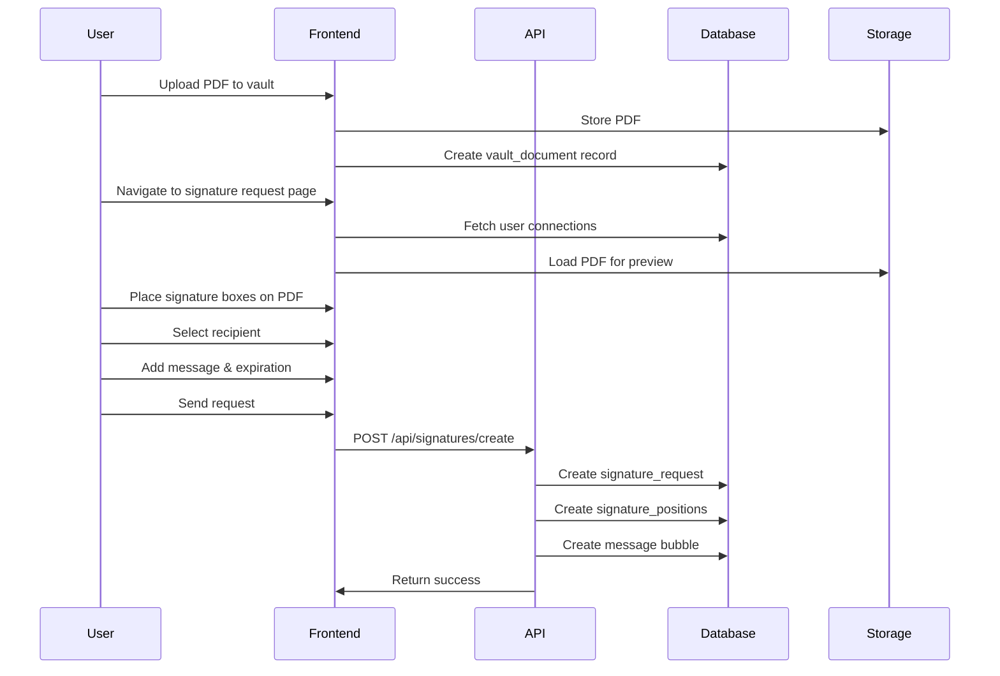
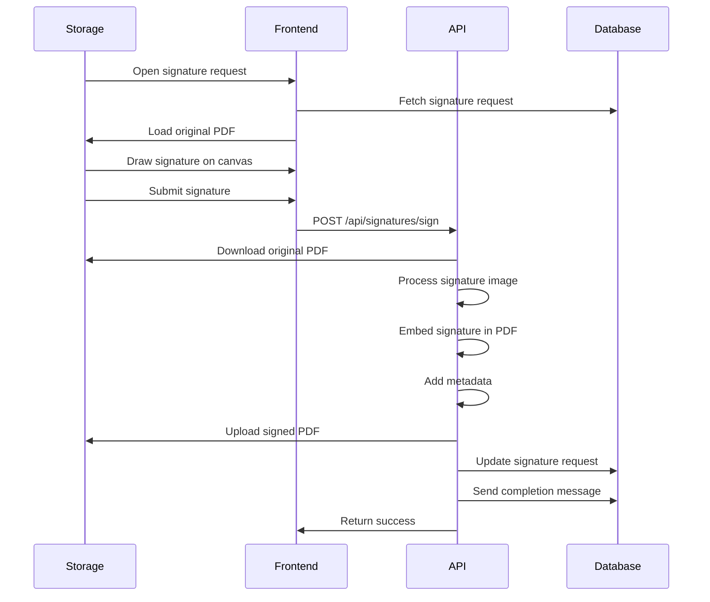

# Signature System Documentation

## Overview

The signature system in SweatShares allows users to create, send, and manage digital signature requests for PDF documents. The system provides a complete workflow from document upload to signature completion, including real-time messaging and secure document storage.

## Table of Contents

1. [System Architecture](#system-architecture)
2. [User Flows](#user-flows)
3. [Database Schema](#database-schema)
4. [API Endpoints](#api-endpoints)
5. [Frontend Components](#frontend-components)
6. [Technical Implementation](#technical-implementation)
7. [Security Considerations](#security-considerations)
8. [Troubleshooting](#troubleshooting)

## System Architecture

### Core Components

```
┌─────────────────┐    ┌─────────────────┐    ┌─────────────────┐
│   Frontend      │    │   Backend       │    │   Storage       │
│                 │    │                 │    │                 │
│ • Signature     │◄──►│ • API Routes    │◄──►│ • Supabase      │
│   Request Page  │    │ • PDF Processing│    │   Storage       │
│ • Signature     │    │ • Message       │    │ • Database      │
│   Viewer        │    │   System        │    │ • RLS Policies  │
│ • Chat System   │    │ • Auth          │    │                 │
└─────────────────┘    └─────────────────┘    └─────────────────┘
```

### Technology Stack

- **Frontend**: Next.js 14, React, TypeScript, Tailwind CSS
- **Backend**: Next.js API Routes, Supabase
- **PDF Processing**: PDF.js (viewing), pdf-lib (editing)
- **Storage**: Supabase Storage with RLS policies
- **Database**: PostgreSQL with Supabase
- **Real-time**: Supabase Realtime for messaging

## User Flows

### 1. Creating a Signature Request



### 2. Signing a Document



## Database Schema

### Core Tables

#### `signature_requests`
```sql
CREATE TABLE signature_requests (
  id UUID PRIMARY KEY DEFAULT gen_random_uuid(),
  document_id UUID REFERENCES vault_documents(id),
  sender_id UUID REFERENCES profiles(id),
  receiver_id UUID REFERENCES profiles(id),
  status TEXT CHECK (status IN ('pending', 'signed', 'declined', 'expired')),
  message TEXT,
  expires_at TIMESTAMP WITH TIME ZONE,
  signed_at TIMESTAMP WITH TIME ZONE,
  signature_data JSONB,
  created_at TIMESTAMP WITH TIME ZONE DEFAULT NOW(),
  updated_at TIMESTAMP WITH TIME ZONE DEFAULT NOW()
);
```

#### `signature_positions`
```sql
CREATE TABLE signature_positions (
  id UUID PRIMARY KEY DEFAULT gen_random_uuid(),
  signature_request_id UUID REFERENCES signature_requests(id) ON DELETE CASCADE,
  page_number INTEGER NOT NULL,
  x_position DECIMAL NOT NULL,
  y_position DECIMAL NOT NULL,
  width DECIMAL NOT NULL,
  height DECIMAL NOT NULL,
  field_type TEXT CHECK (field_type IN ('signature', 'date', 'text', 'checkbox')),
  field_label TEXT,
  required BOOLEAN DEFAULT true,
  created_at TIMESTAMP WITH TIME ZONE DEFAULT NOW()
);
```

### Relationships

- `signature_requests.document_id` → `vault_documents.id`
- `signature_requests.sender_id` → `profiles.id`
- `signature_requests.receiver_id` → `profiles.id`
- `signature_positions.signature_request_id` → `signature_requests.id`

## API Endpoints

### 1. Create Signature Request

**Endpoint**: `POST /api/signatures/create`

**Request Body**:
```typescript
{
  document_id: string;
  receiver_id: string;
  message?: string;
  expires_at?: string;
  positions: {
    page_number: number;
    x_position: number;
    y_position: number;
    width: number;
    height: number;
    field_type: 'signature' | 'date' | 'text' | 'checkbox';
    field_label?: string;
    required: boolean;
  }[];
}
```

**Response**:
```typescript
{
  success: boolean;
  signatureRequest: SignatureRequest;
}
```

### 2. Sign Document

**Endpoint**: `POST /api/signatures/sign`

**Request Body**:
```typescript
{
  requestId: string;
  signatureData: string; // Base64 encoded signature image
}
```

**Response**:
```typescript
{
  success: boolean;
  signatureRequest: SignatureRequest;
  signedDocument: {
    filepath: string;
    filename: string;
  };
}
```

### 3. Decline Signature Request

**Endpoint**: `POST /api/signatures/decline`

**Request Body**:
```typescript
{
  requestId: string;
}
```

## Frontend Components

### 1. Signature Request Page (`/dashboard/signature/request`)

**Features**:
- PDF viewer with interactive signature box placement
- Drag-and-drop signature box positioning
- Recipient selection from user connections
- Message and expiration configuration
- Real-time preview of signature boxes

**Key Components**:
- `SignatureRequestPage`: Main component
- PDF.js integration for document rendering
- Canvas-based signature box overlay
- Connection selector with search

### 2. Signature Viewer (`/dashboard/signature/[id]`)

**Features**:
- Document preview with signature status
- Canvas-based signature drawing
- Signature submission and decline options
- Download signed document

**Key Components**:
- `SignaturePage`: Main component
- Signature canvas with drawing tools
- Document preview with iframe
- Status indicators and metadata display

### 3. Signature Request Dialog

**Features**:
- Quick signature request creation
- Simplified recipient selection
- Inline document preview

## Technical Implementation

### PDF Processing

#### 1. Document Viewing
```typescript
// Using PDF.js for client-side rendering
const pdfjsLib = await import('pdfjs-dist');
pdfjsLib.GlobalWorkerOptions.workerSrc = '/pdf.worker.min.js';

const loadingTask = pdfjsLib.getDocument({ url: pdfUrl });
const pdf = await loadingTask.promise;
const page = await pdf.getPage(pageNum);

const viewport = page.getViewport({ scale: 1.5 });
canvas.height = viewport.height;
canvas.width = viewport.width;

await page.render({ canvasContext: context, viewport }).promise;
```

#### 2. Document Signing
```typescript
// Using pdf-lib for server-side PDF manipulation
import { PDFDocument, rgb } from 'pdf-lib';

const pdfDoc = await PDFDocument.load(pdfBytes);
const pages = pdfDoc.getPages();

// Embed signature image
const signaturePdfImage = await pdfDoc.embedPng(signatureImage);

// Add signature to page
page.drawImage(signaturePdfImage, {
  x: signatureX,
  y: signatureY,
  width: signatureWidth,
  height: signatureHeight,
});
```

### Signature Box Management

#### Coordinate System
- **Viewer Scale**: 1.5x for better visibility
- **Storage**: Coordinates stored at viewer scale
- **Processing**: Coordinates scaled back to 1.0x for PDF embedding

#### Box Sizing
```typescript
// Default signature box dimensions
const defaultWidth = 300;  // pixels at 1.5x scale
const defaultHeight = 200; // pixels at 1.5x scale

// Minimum dimensions
const minWidth = 100;
const minHeight = 80;
```

#### Aspect Ratio Preservation
```typescript
// Calculate optimal signature size while maintaining aspect ratio
const signatureAspectRatio = signaturePdfImage.width / signaturePdfImage.height;
let signatureWidth = signatureAreaWidth;
let signatureHeight = signatureWidth / signatureAspectRatio;

// Scale down if needed
if (signatureHeight > signatureAreaHeight) {
  signatureHeight = signatureAreaHeight;
  signatureWidth = signatureHeight * signatureAspectRatio;
}
```

### Message System Integration

#### Signature Request Messages
```typescript
const messageContent = JSON.stringify({
  type: 'signature_request',
  signatureRequestId: request.id,
  documentName: document.filename,
  senderName: senderName,
  message: request.message
});
```

#### Signature Completion Messages
```typescript
const messageContent = JSON.stringify({
  type: 'document_signed',
  signatureRequestId: request.id,
  documentName: document.filename,
  signerName: signerName
});
```

## Security Considerations

### 1. Authentication & Authorization
- All endpoints require valid user authentication
- Users can only access their own signature requests
- Senders can only modify their own requests
- Receivers can only sign requests sent to them

### 2. File Security
- Documents stored in Supabase Storage with RLS policies
- Signed documents stored in separate user-specific folders
- File access controlled by database permissions

### 3. Data Validation
- Input validation on all API endpoints
- File type restrictions (PDF only)
- Size limits on signature images
- Coordinate bounds checking

### 4. RLS Policies

#### `signature_requests`
```sql
-- Users can only see requests they sent or received
CREATE POLICY "Users can view their signature requests" ON signature_requests
  FOR SELECT USING (
    auth.uid() = sender_id OR auth.uid() = receiver_id
  );

-- Users can only create requests as sender
CREATE POLICY "Users can create signature requests" ON signature_requests
  FOR INSERT WITH CHECK (auth.uid() = sender_id);

-- Users can only update their own requests
CREATE POLICY "Users can update their signature requests" ON signature_requests
  FOR UPDATE USING (auth.uid() = sender_id OR auth.uid() = receiver_id);
```

#### `signature_positions`
```sql
-- Users can only access positions for their requests
CREATE POLICY "Users can view signature positions" ON signature_positions
  FOR SELECT USING (
    EXISTS (
      SELECT 1 FROM signature_requests 
      WHERE id = signature_positions.signature_request_id 
      AND (sender_id = auth.uid() OR receiver_id = auth.uid())
    )
  );
```

## Troubleshooting

### Common Issues

#### 1. Signature Deformation
**Problem**: Signature appears stretched or distorted in final PDF

**Solution**: 
- Ensure signature box is large enough (minimum 100×80px)
- Check that aspect ratio preservation is working
- Verify coordinate scaling (1.5x viewer → 1.0x PDF)

#### 2. PDF Loading Issues
**Problem**: PDF fails to load in viewer

**Solution**:
- Check file permissions in Supabase Storage
- Verify PDF.js worker is properly loaded
- Ensure PDF file is not corrupted

#### 3. Signature Box Positioning
**Problem**: Signature appears in wrong location

**Solution**:
- Verify coordinate system scaling
- Check that PDF viewer scale matches processing scale
- Ensure Y-coordinate flipping is correct

#### 4. Message Bubbles Not Appearing
**Problem**: No notification when signature request is sent

**Solution**:
- Check message creation in `createSignatureRequest` function
- Verify user connections exist
- Ensure message content is properly formatted

### Debug Tools

#### 1. Browser Console
```javascript
// Check PDF.js loading
console.log('PDF.js loaded:', typeof pdfjsLib !== 'undefined');

// Check signature box coordinates
console.log('Signature boxes:', signatureBoxes);

// Check canvas dimensions
console.log('Canvas size:', canvas.width, 'x', canvas.height);
```

#### 2. Network Tab
- Monitor API requests to `/api/signatures/*`
- Check file upload/download requests
- Verify message creation requests

#### 3. Database Queries
```sql
-- Check signature requests
SELECT * FROM signature_requests WHERE sender_id = 'user-id';

-- Check signature positions
SELECT * FROM signature_positions 
WHERE signature_request_id = 'request-id';

-- Check messages
SELECT * FROM messages 
WHERE content::json->>'type' = 'signature_request';
```

## Performance Considerations

### 1. PDF Processing
- Use PDF.js for client-side viewing (no server load)
- Process PDFs server-side only for signing
- Implement proper error handling and timeouts

### 2. File Storage
- Compress signature images before storage
- Use appropriate content types for files
- Implement file cleanup for expired requests

### 3. Database Optimization
- Index frequently queried columns
- Use efficient joins for related data
- Implement pagination for large result sets

## Future Enhancements

### 1. Advanced Features
- Multiple signature types (text, date, checkbox)
- Signature templates and presets
- Bulk signature requests
- Signature verification and audit trails

### 2. Integration
- Email notifications
- Third-party signature services
- Document templates
- API for external integrations

### 3. User Experience
- Drag-and-drop file upload
- Signature preview before submission
- Mobile-optimized signature drawing
- Offline signature capability

---

*This documentation covers the complete signature system implementation in SweatShares. For technical support or questions, please refer to the troubleshooting section or contact hello@celco.agency or adnan.benchaiba@gmail.com 